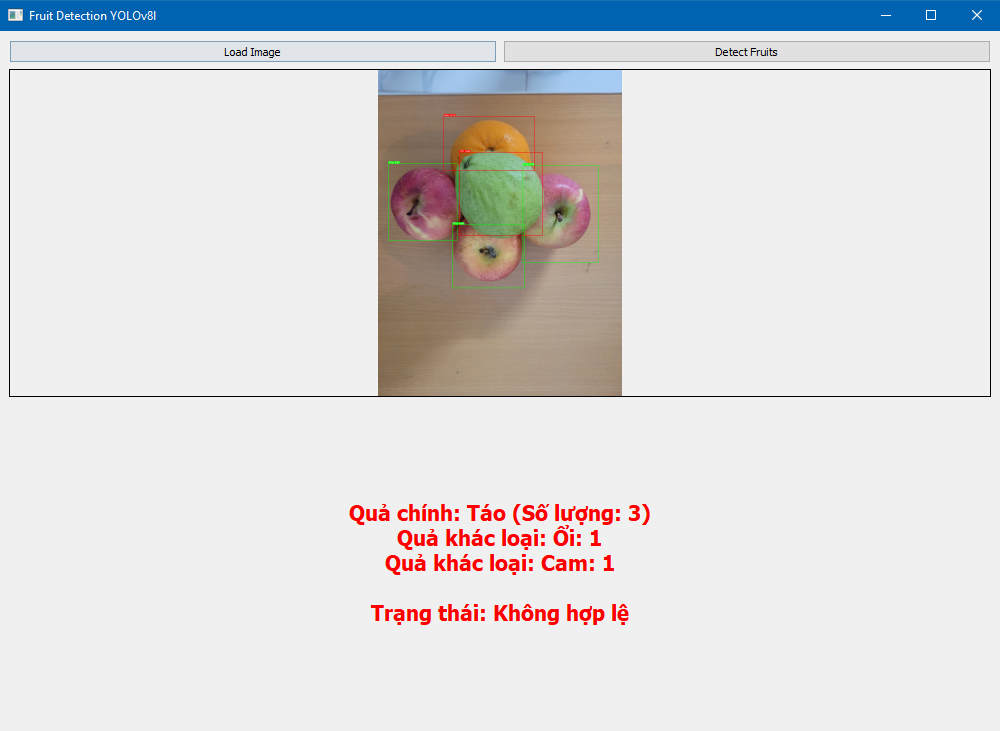

# Fruit Recognition Project with YOLOv8
This project uses the YOLOv8 model to detect and classify fruits in images or videos. The user interface is built using PyQt5 , allowing users to interact with the application easily.

----
## System Requirements
Before running the project, ensure your system meets the following requirements:

- Operating System : Windows, macOS, or Linux.
- Python Version : Python 3.8 or higher.
- GPU (Optional) : A GPU will significantly improve performance if available.
- Dependencies : All required libraries are listed in the requirements.txt file.

---
## Installation
#### Step 1: Clone the Repository
Clone the project repository to your local machine:
```
git clone https://github.com/qhaof26/fruit-detection.git
cd fruit-recognition
```
#### Step 2: Install Dependencies
Install all required libraries using the requirements.txt file:
```
pip install -r requirements.txt
```
#### Step 3: Download the Pre-trained Model
Ensure that the pre-trained model file best.pt is placed in the models/ directory. If not available:

You can retrain the model using your dataset.
Alternatively, download the best.pt file from an external source and place it in the models/ folder.

---

## Usage
#### Step 1: Run the Application
Run the main script of the project:
```
python pre_yolo.py
```
#### Step 2: Interact with the Interface
The application provides a simple graphical user interface (GUI) for detecting fruits:

Open an Image :
Click the "Open Image" button to select an image from your computer.
Detect Fruits :
After selecting an image, the application will automatically detect fruits using the YOLOv8 model.
View Results :
Detected fruits will be marked on the image, and their names will be displayed.

----
## Example Output
#### Confusion Matrix


#### Predict

---
